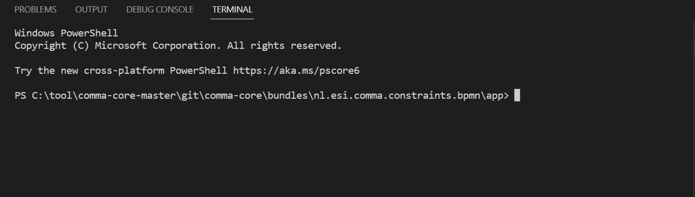

# BPMN_Viewer
This is an extension of the BPMN.io app [bpmn-js](https://github.com/bpmn-io/bpmn-js).

## Installation
To develop the code, you need to install [Visual Studio Code](https://code.visualstudio.com/) and [NodeJS](http://nodejs.org).
- Open the Visual Studio Code, then choose File -> Open Folder...
- Select the app folder under the project 'nl.esi.comma.constraints.bpmn'.
- Choose Terminal -> New Terminal. In the console, you can execute the npm command. <br/>
- Run the npm install at the first time you check in the code.

## Building

At first, to install all project dependencies execute

```
npm install
```

Run the application locally.

```
npm start
```

Build the application (including [bpmn-js](https://github.com/bpmn-io/bpmn-js)) via

```
npm run all
```

You may also spawn a development setup by executing

```
npm run dev
```

Both tasks generate the distribution ready client-side modeler application into the `public` folder.

Serve the application locally or via a web server (nginx, apache, embedded).